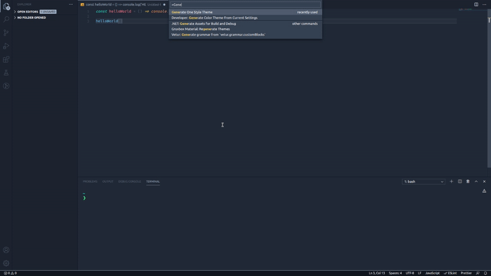

# Bye Bye Borders
>In Development

Bye Bye Borders is an extension that removes the limits that themes have, transforming the VSCode interface into a single color palette based on the main color of your theme.
